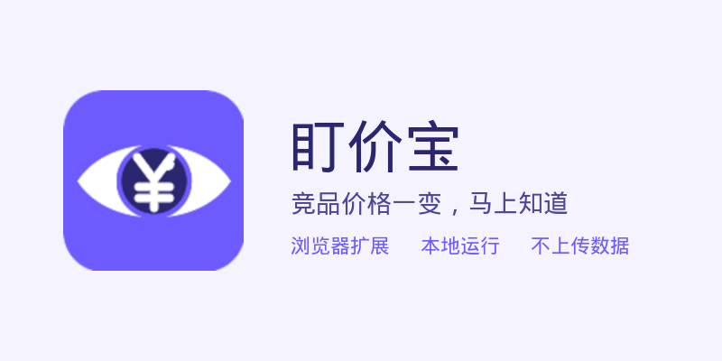

<h1 align="center">盯价宝</h1>

竞品价格一变,马上知道 —— 面向跨境卖家的浏览器扩展

  

## 它做什么

在任意商品页点一下**价格 / 库存 / 评分**,盯价宝会定时帮你重新检查,一有变化就桌面通知。

- 🖱️ 点选即监控:不用写规则,不用配置
- 💻 本地运行:数据只存在你的浏览器,不上传、不注册
- 🔔 变动通知:桌面提醒 + 图标角标 + 历史记录
- 🌐 任意网站:Amazon、速卖通、1688、独立站……你点哪就盯哪

## 免费版 / Pro

| | 免费版 | Pro(买断) |
|---|---|---|
| 监控项 | 3 个 | 不限 |
| 最短检查间隔 | 6 小时 | 30 分钟 |
| 导出 CSV | — | ✅ |
| 设备数 | 不限 | 不限 |
| 价格 | 永久免费 | ¥49(首发 ¥29,限前 50 名) |

## 安装

**[▶ Edge 商店安装(推荐)](https://microsoftedge.microsoft.com/addons/detail/ihnmgcceeglbajigfmfhaojcdmaolcjn)** · Chrome 商店审核中

## 状态

✅ 已上架 Microsoft Edge 商店(2026-09-02);Chrome 版审核中。

## 文档

- [使用说明](guide.md)
- [隐私政策](privacy.md)

## 同门产品:盯榜宝(亚马逊关键词排名监控)

输入关键词 + ASIN,每天自动查亚马逊搜索排名,自然位/含广告位分开报告,变化桌面提醒。→ [使用说明](guide-rankwatch.md) · [购买 Pro](buy.md)

## 支持与购买

- **[购买 Pro 激活码 →](buy.md)**(¥49 买断,首发 ¥29,四步指引与常见问题)
- 爱发电主页:**https://ifdian.net/a/dingjiabao**
- 反馈与需求:提 [Issue](../../issues),或爱发电私信

## 作者

Simon Zhong · 11 年全栈开发,长期在跨境电商行业做物流、地址、邮件营销相关系统。
